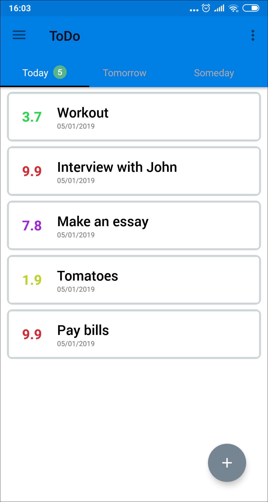

Do Them: ToDo list reminder
=============

A simple To-Do app implementing some features I tried to learn

- LiveData
- MVVM Architecture
- Third-party libraries

## Screenshots

  

## Credits

- https://github.com/tyrantgit/ExplosionField
- https://github.com/PSD-Company/duo-navigation-drawer
- https://github.com/Krupen/FabulousFilter
- https://github.com/medyo/Fancybuttons
- https://github.com/airbnb/lottie-android
- https://github.com/tankery/CircularSeekBar

